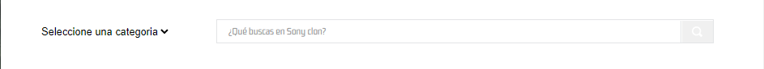

# Deparment search

Component that renders results of a chosen department in a selection block



## Configuration

### Step 1 - Cloning the repository

Clone this [repository](https://github.com/jhonortizgomez/itgloberspartnercl-custom-deparment-search.git) on your computer.

### Step 2 - Editing the `Manifest.json`

Once in the repository directory, it is time to edit the `manifest.json` file.

Once you are in the file, you must replace the `vendor` value. `vendor` is the account name you are working on, if you want yo can modify name, titel, and description. For example:

```json
{
  "vendor": "vtexvendor",
  "name": "custom-component"
}
```

You should also check the `package.json` file globar and the file in react folder, verify the name and the version.

### Step 3 - Installing node-modules

In your terminal enter in react folder, command (cd react), then put yarn in the terminal, this commad install node-modules folder, close your editor and open again
the project in your editor, you should have install and funtional the modules in react folder.

### Step 4- Run and preview your component

Then time has come to upload all the changes you made in your local files to the platform. For that, use the `vtex link` command. If the process runs without any  
errors, the following message will be displayed: `App linked successfully`.

To use the component in a store you should this in your "dependencies" in `manifest.json` file, "vendorName.componentName" : "version", for example:

```json
{
  "dependencies": {
    "itgloberspartnercl.custom-deparment-search": "0.x"
  }
}
```

Then put the component where ever you need.

This will enable you to see the applied changes in real time, through the account and workspace in which you are working.

## Dependencias

1.  "vtex.css-handles": "0.x",
2.  "vtex.store-graphql": "2.x",
3.  "vtex.store-components": "3.x"

### Contributors

1. Jhon Ortiz Gómez
